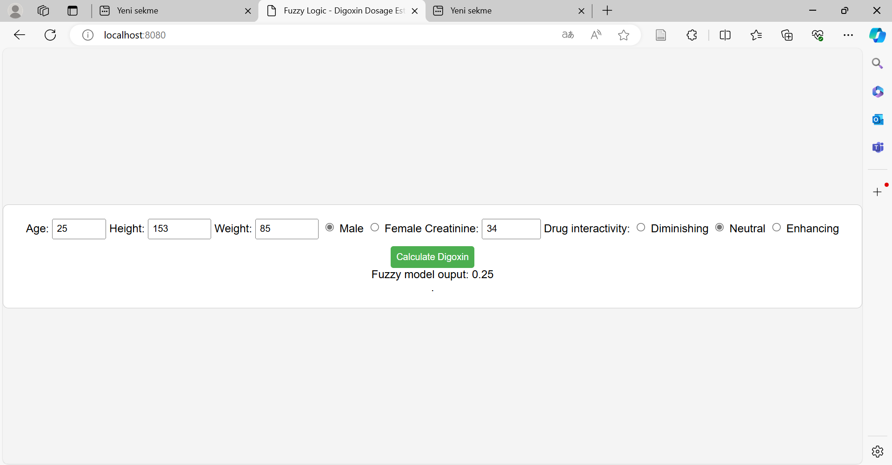

# Digoxin Dosage Estimator

Örnek ekran görüntüsü:

## Java 

(`java -version`)

`openjdk version "21.0.1" 2023-10-17`

## Node.js

(`node -v`)

`v20.10.0`

## Server Çalıştırma

`node server.js`

## Nasıl Çalışıyor?

* Server `node server.js` komutu ile çalıştırılıyor.
* `localhost:8080`'de uygulamaya erişilebiliyor.
* Arayüz aracılığıyla bazı değişkenler giriliyor/seçiliyor.
* "Calculate" butonuna tıklandığında `script.js` içerisinde bu değişkenlerle bazı hesaplamalar yapılıyor. Nihai olarak, girdiler üç değişkene indirgeniyor: `crcl, ibw, drugInteractivity`
* Üç değişken `server.js`'e request olarak gönderiliyor.
* Server bu üç değişkeni alarak bir komut içerisine yerleştiriyor ve `exec` ile çalıştırıyor:
* Çalıştırılan komut: `java -jar ${JAVA_PROGRAM_PATH} ${crcl} ${ibw} ${drug_interactivity}`
* `${JAVA_PROGRAM_PATH}` çalıştırılacak Java (JAR) dosyasının bulunduğu konum. Bu konum: `./digoxin_java/out/artifacts/digoxin_java_jar/crane_java.jar"`
* Hesaplanan sonuç script'e geri gönderiliyor.

## Örnek Senaryo
Arayüz ile aşağıdaki değerler girildiğinde:
* Age: 70
* Height: 153
* Weight: 85
* Male
* Creatinine: 1
* Neutral

Server'ın `0.25` yanıtını verip, arayüzde `Fuzzy model output: 0.25` metninin görünmesi beklenir.